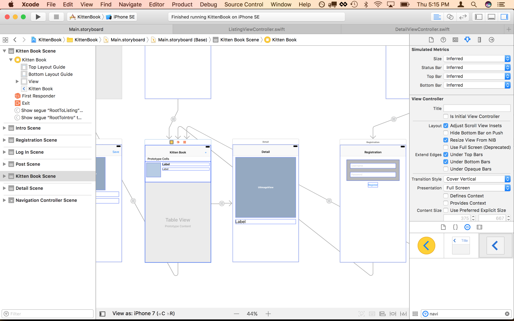
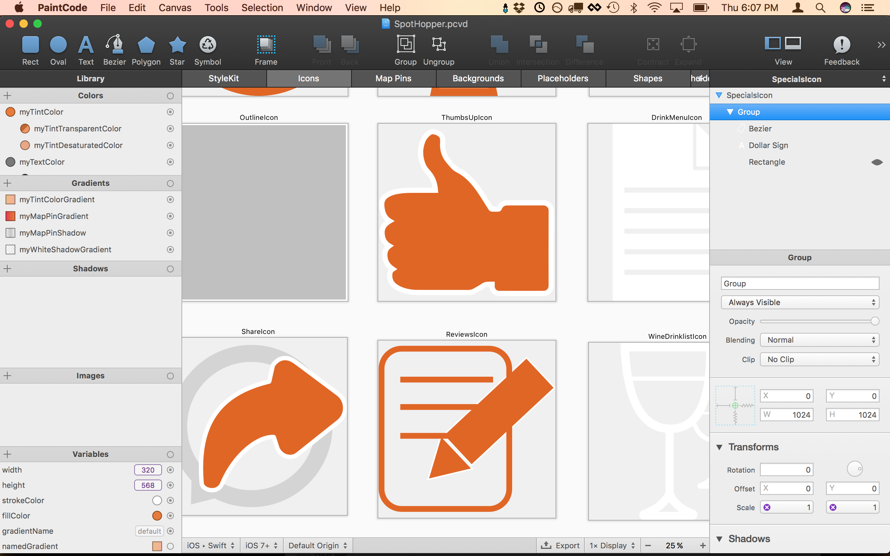
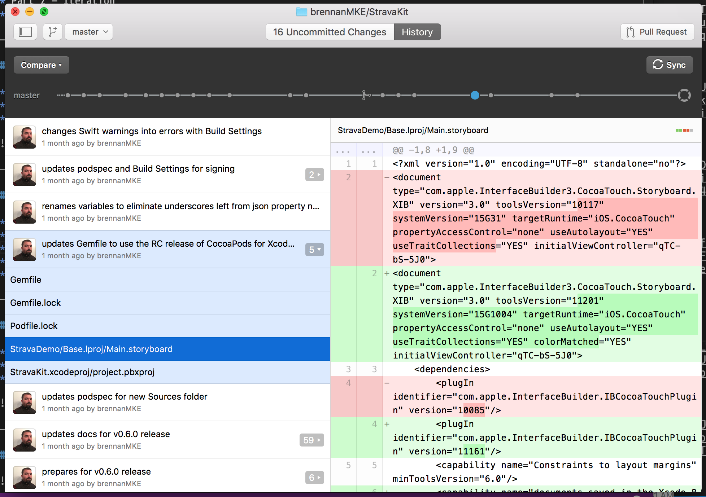
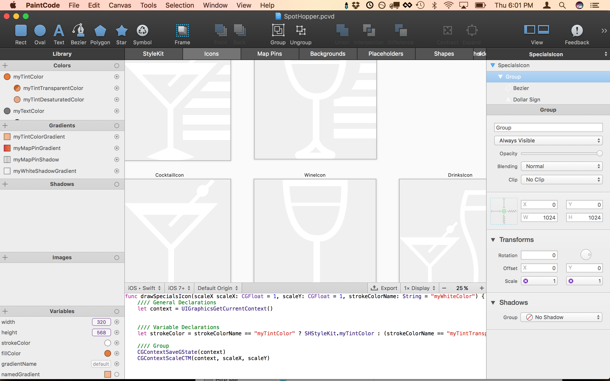
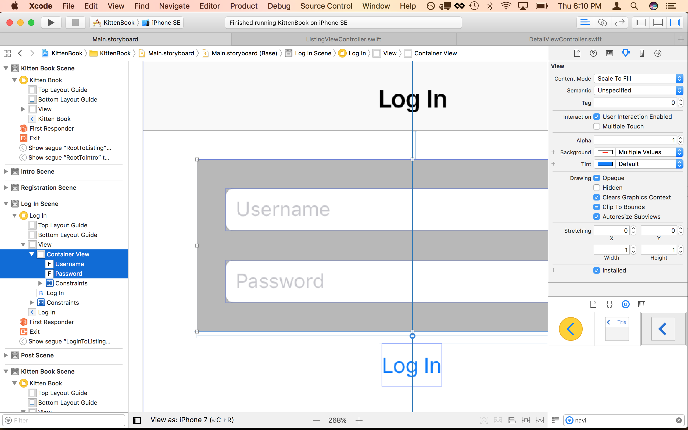
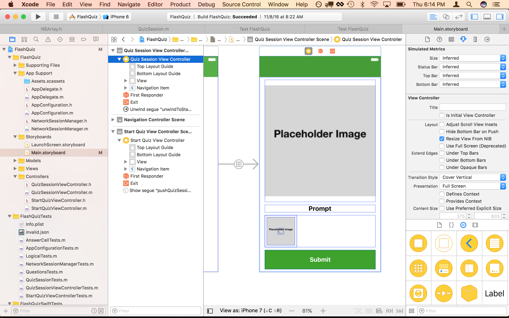
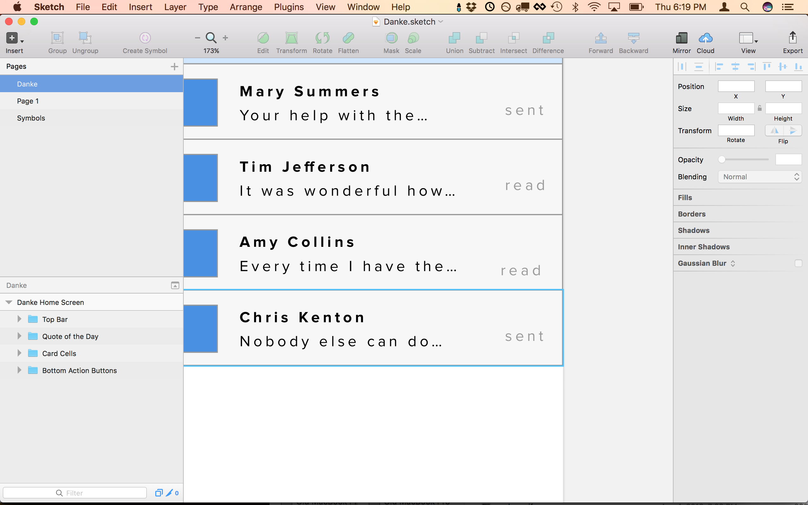

## Storyboarding with Xcode

* Collaborate
* Iterate
* Have fun

--- 

# Who am I?

Brennan Stehling

* iOS Engineer
* Friend of designers
* Admirer of User Experience

---

## Summary

* Part 1 - Collaboration
* Part 2 - Iteration
* Part 3 - Enjoy Creating

---

## Part 1 - Collaboration

* Let's talk about collaboration.
* Developers want to write code
* Developers really should not do design

---

## GitHub for the Desktop

* Clone the repositority
* Create a branch
* Make your changes
* Commit and push
* Send a Pull Request
* See [GitHub Flow](https://guides.github.com/introduction/flow/index.html)

---

## PaintCode

* Draw everything
* Export to code
* Create interactive views
* Bonus: now works with Android and Web
* See [PaintCode](https://www.paintcodeapp.com)

---

## Part 2 - Iteration

* Try the app in the iOS Simulator
* Tweak a screen or change some fonts
* Reposition some views
* Change the entire feel of the app

---

## What can you change?

* Fonts
* Colors
* Sizes
* Layouts

---

## How is this better than a big Sketch document?

* Make changes directly
* Try small tweaks until you are happy
* No need to involve others
* Share changes when you are ready
* Results will be exactly what you wanted

---

## But mostly, it makes you happy

---

### More about PaintCode

* It works with Sketch
* It works with PhotoShop
* Sync the files on GitHub
* Keep using the tools you know and love

---

## Part 3 - Enjoy Creating

* See [Training Videos](http://sstools.co/csfsb2016)
* Get [Kitten Book](https://github.com/brennanMKE/KittenBook)
* Try it yourself
* Can I get a volunteer?!

--- 

## Thank you!

---

# Questions?

### Brennan Stehling
#### github.com/brennanMKE
#### www.smallsharptools.com
#### Videos: http://sstools.co/csfsb2016
#### https://github.com/brennanMKE/KittenBook

